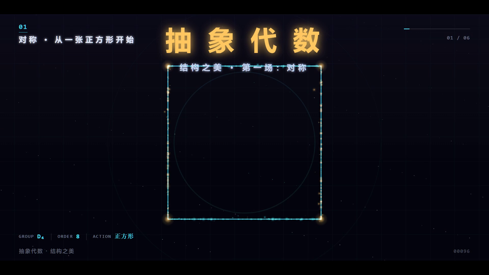

# 抽象代数 · 结构之美

**一条 3 分 30 秒的中文宣传片，讲抽象代数的美 —— 不从定义出发。**

每一段抽象代数都落在一件能看见的东西上：一张正方形的 8 种对称、圆上 45° 一跳的循环、
一个魔方的 43,252,003,274,489,856,000 种状态、一面把大群压成小群的透镜、
一条还没数清的手串、一把锁住你每一次支付的椭圆曲线。

[](out/abstract-algebra-film_1080p.mp4)

**▶ [下载/播放成片 out/abstract-algebra-film_1080p.mp4](out/abstract-algebra-film_1080p.mp4)** ｜ 3:30 ｜ 1920×1080 ｜ 30fps ｜ 47 MB ｜ H.264 + AAC

> A 3.5-minute Chinese-language promo film about the beauty of abstract algebra.
> Every concept is anchored to something visible — symmetry of a square, roots of unity,
> a Rubik's cube's 4.3×10¹⁹ states, the kernel of a homomorphism, Burnside counting,
> elliptic curves, and Galois. Fully procedurally rendered: 6300 frames drawn frame-by-frame
> in a headless Chromium canvas, with a code-synthesized score and 8 lines of Chinese narration.

---

## 六场结构

| # | 时间 | 场次 | 具体入口（不抽象的地方） | 数学点 |
| --- | --- | --- | --- | --- |
| 01 | 0:00 | 对称 | 粒子汇聚成一张正方形，8 种对称（4 旋转 + 4 镜像轴）绕它排开 | 二面体群 D₄、群的四条公理、凯莱表即"闭包" |
| 02 | 0:38 | 循环 | 圆上 45° 一跳、8 次单位根的连线 | 循环群 C₈、轨道-稳定子、模 8 乘法与可逆元 U(8) |
| 03 | 1:08 | 置换 | 1–7 重新编号、7! 的粒子云、慢慢转动的魔方 | 置换与循环分解、S₇、魔方群 4.3×10¹⁹ 状态 |
| 04 | 1:42 | 同态 | 两圆之间流动的映射线、被压成一点的"核" | 核与像、商群、\|G\|=\|ker φ\|·\|im φ\| |
| 05 | 2:18 | 计数 | 64 个染色方案粘成 13 条轨道，手串被数清楚 | 群作用、轨道、Burnside 引理（13 / 92 / 30 对照） |
| 06 | 2:52 | 终章 | 617 位大数、椭圆曲线的弦切作图、五次方程的根 | RSA/ECC 与离散对数、伽罗瓦群 S₅ 不可解 |

片尾字幕：**有解的东西可以被算出来，有结构的东西才能被理解。**

## 技术要点

整条片子没有用任何动画软件，全部由代码逐帧画出来：

- **确定性渲染**：每一帧只依赖时间 `t`，随机数一律来自固定种子的哈希函数。
  因此同一 `t` 可重放、可并行、可只重渲染某一场。同一 `t` 两次绘制像素完全一致。
- **吞吐**：帧由「浏览器 Canvas 绘制 → JPEG → WebSocket → ffmpeg stdin」直通，不落盘中转；
  4 个 headless Chromium 并行渲染不同分片，6300 帧 1.9 分钟出片。
- **排版内核**：自己写了中西文自动混排（中文雅黑 / 拉丁与公式 Cambria / 代码等宽）、
  逐字浮现字幕、行内公式（`` `...` `` 等宽、`*...*` 强调色）、行首安全区与自动断行。
- **程序化配乐**：`audio/score.py` 用 numpy/scipy 合成 —— 和声垫（多锯齿 + 一阶低通）、
  钟（非谐分音指数衰减）、Karplus-Strong 拨弦、低频冲击、噪声 wash，再叠混合响。
  没有任何采样素材。
- **旁白**：Windows SAPI 中文合成 8 句，经 EQ/压缩/短混响塑形，并与音乐做 sidechain 闪避。

## 工程结构

```
beauty-of-structure/
├─ render.html            # 渲染页：Canvas 1920×1080 + 场景注册表
├─ src/
│  ├─ core.js             # 确定性绘制内核（缓动/颜色/光效/群论小工具）
│  ├─ nars.js             # 叙事与排版层（混排、字幕、HUD、计数、转场）
│  ├─ server.js           # 静态服务（给渲染页供 ES 模块）
│  ├─ cdp.js              # 启动 Chromium + CDP 逐帧取图
│  ├─ render.js           # 全片渲染：分片并行 → concat → 音画合成
│  ├─ grab.js             # 抓单帧 PNG/JPG，人工目视验收
│  ├─ measure.js          # 用浏览器实测文案宽度，核对安全区
│  ├─ qa_text.js          # 全片逐帧扫描文字互撞 / 越界
│  ├─ verify_burnside.mjs # 手串轨道数独立校验（枚举 vs Burnside 公式）
│  └─ scenes/s1..s6.js    # 六个场景，每场内部再分镜头，全部 time 参数化
├─ audio/
│  ├─ score.py            # 程序化配乐
│  ├─ tts.ps1             # Windows SAPI 中文旁白 + 时长清单
│  └─ build_audio.mjs     # 旁白绝对时间定位 + sidechain 闪避 + 母带
└─ out/                   # 成片、封面帧、尾帧
```

## 复现

需要 Node ≥ 20（用到内建 `WebSocket`）、Python 3 + numpy/scipy、
Chromium（默认用 Playwright 缓存路径，见 `src/cdp.js` 的 `DEFAULT_CHROME`）、
ffmpeg/ffprobe（默认 `D:/ffmpeg/bin`，可在 `audio/build_audio.mjs` 与 `src/render.js` 里改）。

```powershell
# 1) 配乐（约 1 分钟）
python audio/score.py

# 2) 旁白（Windows SAPI，需要中文语音）
pwsh -NoProfile -File audio/tts.ps1

# 3) 音轨混音 + 母带
node audio/build_audio.mjs

# 4) 全片渲染 + 合成（4 并行，约 2 分钟）
node src/render.js --workers 4

# 只重渲某一场（改了哪场渲染哪场）
node src/render.js --only s3 --workers 2

# 只合成（换了音轨后，不用重渲染画面）
node src/render.js --mux-only

# 抓几帧看效果
node src/grab.js --scene s5 --times 5,13,21,29 --out out/frames/s5
```

## 质量校验

| 项目 | 结果 |
| --- | --- |
| 成片规格 | 1920×1080 / 30fps / 6300 帧 / 210.000 s |
| 解码完整性 | `ffmpeg -f null` 全片解码退出码 0，无报错 |
| 音画同步 | 音视频锚定同一条 30fps 时间轴，片内帧计数水印与时间戳一致 |
| 音频 | 集成响度 -21.5 LUFS、真峰值 -2.5 dBFS（AAC 后仍有余量，不削顶） |
| 旁白 | 成片音轨按 8 个时间点切片后 SAPI 反向识别，8 句全部识别出对应内容 |
| 中文渲染 | 特殊字符（r²、A₅、ℤ、φ、⇒）与中文混排实测正确，无乱码 |
| 排版 | `src/qa_text.js` 逐帧扫描互撞/越界，修掉 3 处真实问题 |
| 数学数字 | 全部程序枚举，不手写：D₄ 凯莱表由顶点置换生成；6 珠 2 色 = 13、6 珠 3 色 = 92、8 珠 2 色 = 30（枚举与公式互证） |

### 开发中修掉的真 bug（留档，都是"看起来没问题但其实错了"那类）

1. **内核 `clamp()` 语义错误**：对小于下界的值返回了上界，导致 `inv(t, 28, 28.9)` 在 `t=3` 时返回 `1`
   —— 所有"时间段门控"失效，后段内容提前乱入，画面变成多层叠加。
2. **发光文字重复绘制**：`text()` 先模糊画一遍再画一遍，把中文字形糊出重影；改为单次绘制 + shadow。
3. **多行文案不支持换行**：`drawRuns()` 把 `\n` 当普通字符，多行文本被挤成一行冲出右边界。
4. **旁白轨拼接被截断**：早期用 concat 串联"静音 + 台词"，第 4、8 句丢失、第 5/6 句重叠；
   改为按绝对时间 `adelay` 定位，并用逐 5 秒 RMS 包络核对 8 段位置。
5. **Burnside 枚举的置换构造错误**：奇数格翻转的取模写法在 n=6 时映射到同一个像（不是置换），
   导致轨道数 13 ≠ 公式值；修正后枚举与公式互证。

## 已知限制

- 旁白是 Windows SAPI 合成音（Huihui），清晰但偏机械。要正式发布建议换真人配音或更好的 TTS：
  替换 `build/narration/n*.wav` 后跑 `node audio/build_audio.mjs && node src/render.js --mux-only`，
  不必重渲染画面。
- 画面为纯 2D Canvas 绘制（无 WebGL/3D 引擎），三维感来自手工投影，不是真 3D。
- 配乐是"能用"级别的程序合成，不是专业编曲。

## 许可

MIT（见 [LICENSE](LICENSE)）。影片内容可自由用于学习、教学与二次创作，署名即可；
音乐与旁白均为程序合成，不含任何第三方采样素材。
